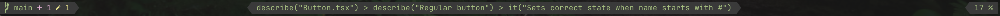
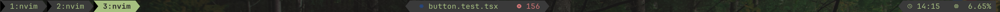

# Welcome to my heavily customized Neovim config

Feel free to copy any parts that may seem interesting to you.

## Telecope-based working with git

Extends [Telescope](https://github.com/nvim-telescope/telescope.nvim) with [Delta](https://github.com/dandavison/delta).

## Fully custom status line

Check the `statusline.lua`. Fully custom, relatively easy to remove and add your own stuff. Styling inspired by [Tmux power](https://github.com/wfxr/tmux-power). Also includes tmux topbar integration.

## Colorscheme

The colorscheme is fully custom, can be found in `appearance.lua`.

## Interesting bits

Check `utils.lua` for a minimal `async/await` implementation using Lua coroutines. Useful for avoiding callback hell when need to spawn a lot of arbitrary processes.

## Coming up

Working on a merge conflict resolution plugin. Checkout `feat/conflict-resolver` branch if interested (almost fully working, but still highly WIP).
